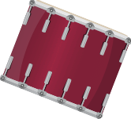

# 🥁 Drum Kit

A fun, interactive drum kit web application built with **React** and **Vite**. Play drums using your keyboard or by clicking the buttons!



## 🎵 Features

- **Keyboard Support** - Press `W`, `A`, `S`, `D`, `J`, `K`, `L` to play different drum sounds
- **Click to Play** - Click any drum button with your mouse
- **Visual Feedback** - Buttons animate when pressed
- **7 Different Sounds** - Tom drums, snare, crash cymbal, and kick bass

## 🚀 Getting Started

### Prerequisites

- [Node.js](https://nodejs.org/) (v16 or higher)
- npm (comes with Node.js)

### Installation

1. Clone the repository:
   ```bash
   git clone https://github.com/yugmarwaha/drum-kit.git
   cd drum-kit
   ```

2. Install dependencies:
   ```bash
   npm install
   ```

3. Start the development server:
   ```bash
   npm run dev
   ```

4. Open [http://localhost:5173](http://localhost:5173) in your browser

## 🎹 Controls

| Key | Sound |
|-----|-------|
| `W` | Tom 1 |
| `A` | Tom 2 |
| `S` | Tom 3 |
| `D` | Tom 4 |
| `J` | Snare |
| `K` | Crash |
| `L` | Kick Bass |

## 🛠️ Built With

- [React](https://react.dev/) - UI Library
- [Vite](https://vitejs.dev/) - Build Tool & Dev Server

## 📁 Project Structure

```
drum-kit/
├── index.html          # Entry HTML file
├── vite.config.js      # Vite configuration
├── package.json        # Dependencies & scripts
├── public/
│   ├── images/         # Drum images
│   └── sounds/         # Drum sound files
└── src/
    ├── main.jsx        # React entry point
    ├── App.jsx         # Main component
    └── App.css         # Styles
```

## 📜 Scripts

| Command | Description |
|---------|-------------|
| `npm run dev` | Start development server |
| `npm run build` | Build for production |
| `npm run preview` | Preview production build |

## 📄 License

ISC

---

Made with ❤️ using React